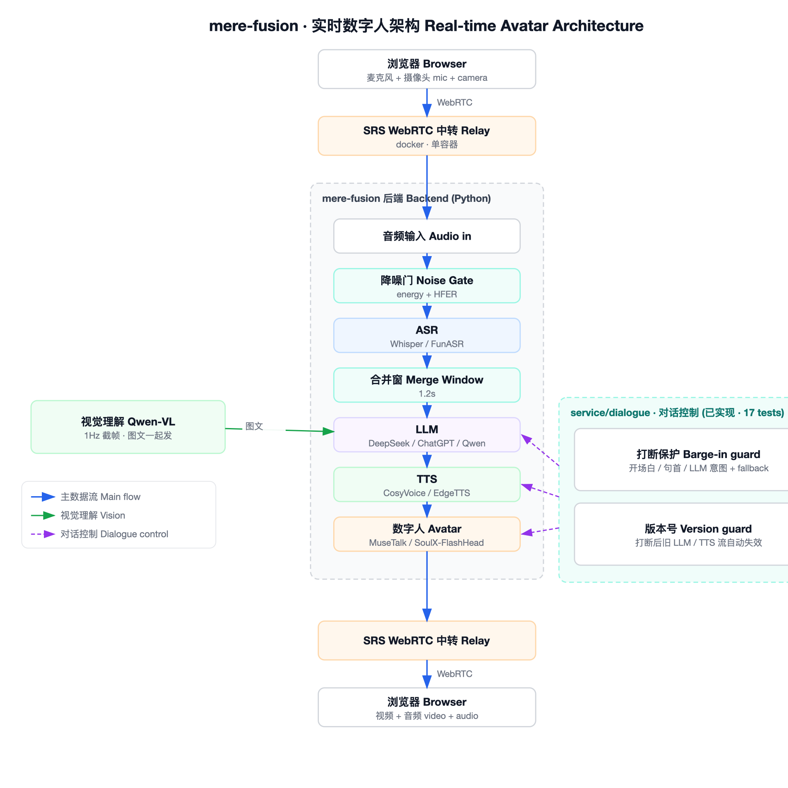

# mere-fusion

> Real-time AI digital human that holds sub-second voice conversations.
> Full pipeline: microphone → ASR → LLM → TTS → lip-synced avatar → WebRTC video stream.
> Put your own face on AI.

[English](#what-you-can-do-with-it) | [中文](#你能用它做什么)

---

## What You Can Do With It

| Use Case | Mode | Pipeline |
|---|---|---|
| **Live digital customer service** | Real-time | WebRTC → ASR → LLM → TTS → avatar → stream |
| **Virtual anchor / streamer** | Real-time | Same as above, relay to OBS / Bilibili |
| **AI voice assistant with a face** | Real-time | Browser → mere-fusion → browser |
| **Language learning partner** | Real-time | Speak → ASR → LLM coach → TTS → avatar |
| **Record tutorial / demo videos** | Offline | Text → TTS → avatar → mp4 |

---

## Architecture



> Vector source: [`docs/architecture.svg`](docs/architecture.svg)

The backend pulls the client's audio/video from SRS, runs the pipeline
**Audio → Noise Gate → ASR → Merge Window → LLM → TTS → Avatar**, and pushes the
generated talking-head stream back to SRS for the browser to play.

### Real-time dialogue control

A production-grade control layer (`service/dialogue/`, **implemented, 17 unit tests**)
makes the conversation interruptible and noise-robust. It lives inside the data flow
above — a noise gate before ASR, a merge window after ASR — plus two cross-cutting guards:

| Mechanism | Role | Module |
|---|---|---|
| Noise gate | Dual-threshold hysteresis + HFER spectral check; freezes the noise floor while the avatar talks so TTS echo can't poison it | `energy_gate.py` |
| Merge window | Holds a finished ASR sentence ~1.2s so VAD-fragmented speech isn't answered mid-thought | `merge_window.py` |
| Barge-in guard | When the user speaks during playback, decides interrupt vs ignore — opening guard / sentence-head guard / LLM intent (+ edit-distance fallback) | `interrupt.py` |
| Version guard | A barge-in bumps the session version, retiring stale LLM/TTS output | `version_guard.py` |

See [`docs/INTEGRATION.md`](docs/INTEGRATION.md) for wiring.

---

## Quick Start

### Prerequisites

- **Python 3.10**
- **GPU**: NVIDIA + CUDA recommended for avatar rendering
- **Docker**: for the SRS relay server
- macOS: `brew install portaudio ffmpeg`
- Linux: `sudo apt install libportaudio2 portaudio19-dev ffmpeg`

### 1. Setup

```bash
git clone https://github.com/Caxson/mere-fusion.git
cd mere-fusion

python3.10 -m venv myenv
source myenv/bin/activate
pip install --upgrade pip
pip install -r requirements.txt

cp .env.example .env   # then add your OPENAI_API_KEY
```

MuseTalk also needs mmlab packages:

```bash
pip install --no-cache-dir -U openmim
mim install mmengine "mmcv>=2.0.1" "mmdet>=3.1.0" "mmpose>=1.1.0"
```

### 2. Start SRS (one command)

```bash
docker-compose up -d
# Verify: curl http://localhost:1985/api/v1/streams/
```

Or set a public candidate IP for remote access:

```bash
SRS_CANDIDATE=your.server.ip docker-compose up -d
```

### 3. Run the backend

```bash
python app.py --model musetalk --tts edgetts
```

### 4. Frontend

Vue.js client: [Caxson/mere_web_client](https://github.com/Caxson/mere_web_client)

---

## Modules

### ASR (Speech-to-Text)

| Engine | Notes |
|---|---|
| Whisper / WhisperTimestamped | OpenAI Whisper with timestamps |
| FasterWhisper | Optimized Whisper, faster transcription |
| OpenAI API ASR | Cloud speech-to-text |
| InsanelyFastWhisper | HuggingFace `transformers` pipeline |

Modes: offline / chunked / online (real-time), with optional VAD.

### LLM

| Engine | Notes |
|---|---|
| ChatGPT | OpenAI API |
| Qwen | Open-source, local or cloud |
| Gemini | Google multimodal |

### TTS (Text-to-Speech)

| Engine | Notes |
|---|---|
| EdgeTTS | Microsoft Azure voices, free, no GPU |
| CosyVoice | Zero-shot voice cloning from reference audio |
| GPT-SoVITS | Reference-timbre synthesis |
| XTTS | Voice cloning from a reference clip |

### Avatar (Digital Human)

| Engine | Notes |
|---|---|
| MuseTalk | Real-time lip-sync via latent inpainting |
| ErNeRF | NeRF-based 3D talking head |
| Wav2Lip | Classic lip-sync |

### Vision (optional)

YOLO object detection + DeepFace (age/gender/emotion) + EasyOCR text recognition
on the incoming video frames.

---

## Project Structure

```
mere-fusion/
├── app.py                    # Main aiohttp + WebRTC server
├── docker-compose.yml        # One-line SRS relay
├── .env.example              # Environment variable template
│
├── whisper_online.py         # ASR engines
├── stream_openai_video.py    # LLM streaming + session management
├── ttsreal.py                # TTS engines
│
├── musereal.py / museasr.py  # MuseTalk avatar
├── nerfreal.py / nerfasr.py  # ErNeRF avatar
├── lipreal.py  / lipasr.py   # Wav2Lip avatar
├── webrtc.py                 # WebRTC HumanPlayer track
├── yolo_opencv.py            # Vision processing
│
├── llm/                      # LLM adapters (ChatGPT/Qwen/Gemini/DeepSeek)
├── service/dialogue/         # Real-time dialogue control (noise gate / merge
│                             #   window / barge-in / version guard) + tests
├── avatar/ vision/ doubao/   # 2026 engines (opt-in): SoulX/EchoMimicV3, Qwen-VL, Doubao
├── musetalk/ ernerf/ wav2lip/# Avatar model code + weights
├── examples/record_tech_video/ # Markdown → mp4 pipeline
├── tests/                    # Unit tests (dialogue 17, doubao protocol 8)
├── data/                     # Avatar assets, pretrained weights
└── docs/                     # Architecture, roadmap, upgrade, integration
```

---

## Roadmap

The 2026 modernization plan (streaming avatars, faster ASR, lower end-to-end latency)
is tracked in [`docs/UPGRADE_PLAN_2026.md`](docs/UPGRADE_PLAN_2026.md) and
[`docs/ROADMAP.md`](docs/ROADMAP.md). Highlights under evaluation:

- **Avatar**: SoulX-FlashHead (streaming, 96 fps) for real-time, EchoMimicV3 (half-body + gestures) for offline video
- **ASR**: FunASR for low-latency Chinese
- **LLM**: DeepSeek-V4 Flash for fast TTFT
- **TTS**: CosyVoice 3 streaming + zero-shot clone

> The real-time dialogue control layer is **already implemented** — see Architecture above.

---

## License

[MIT](LICENSE)

---

## 你能用它做什么

| 场景 | 模式 | 链路 |
|---|---|---|
| **数字人客服** | 实时 | WebRTC → ASR → LLM → TTS → 数字人 → 推流 |
| **虚拟主播** | 实时 | 同上，转推 OBS / B 站 |
| **带脸的 AI 语音助手** | 实时 | 浏览器 → mere-fusion → 浏览器 |
| **语言学习陪练** | 实时 | 说话 → ASR → LLM 教练 → TTS → 数字人 |
| **录制教程 / 演示视频** | 离线 | 文本 → TTS → 数字人 → mp4 |

---

## 架构


> 矢量源文件：[`docs/architecture.svg`](docs/architecture.svg)

后端从 SRS 拉取客户端音视频流，跑完
**音频 → 降噪门 → ASR → 合并窗 → LLM → TTS → 数字人** 链路，
再把生成的数字人画面推回 SRS，由浏览器播放。

### 实时对话控制层

一个生产级控制层（`service/dialogue/`，**已实现，17 个单元测试**）让对话可打断、抗噪。
它嵌在上面的数据流里 —— ASR 前一道降噪门、ASR 后一个合并窗 —— 外加两个横切保护：

| 机制 | 作用 | 模块 |
|---|---|---|
| 降噪门 | 双门限滞回 + HFER 高频能量比二次确认；数字人播放时冻结噪声基线，防止 TTS 回声污染 | `energy_gate.py` |
| 合并窗 | ASR 出句后保留约 1.2s，避免 VAD 切碎的半句被提前回应 | `merge_window.py` |
| 打断保护 | 用户在播放期说话时判断「打断还是忽略」—— 开场白 / 句首 / LLM 意图（+ 编辑距离 fallback） | `interrupt.py` |
| 版本号 | 打断后递增会话版本号，让旧 LLM/TTS 输出自动失效 | `version_guard.py` |

接入方法见 [`docs/INTEGRATION.md`](docs/INTEGRATION.md)。

---

## 快速开始

### 系统要求

- Python 3.10
- GPU: 推荐 NVIDIA + CUDA（数字人渲染）
- Docker（SRS 中转）
- macOS: `brew install portaudio ffmpeg`
- Linux: `sudo apt install libportaudio2 portaudio19-dev ffmpeg`

### 1. 安装

```bash
git clone https://github.com/Caxson/mere-fusion.git
cd mere-fusion

python3.10 -m venv myenv
source myenv/bin/activate
pip install --upgrade pip
pip install -r requirements.txt

cp .env.example .env   # 然后填入你的 OPENAI_API_KEY
```

MuseTalk 还需要 mmlab 系列包：

```bash
pip install --no-cache-dir -U openmim
mim install mmengine "mmcv>=2.0.1" "mmdet>=3.1.0" "mmpose>=1.1.0"
```

### 2. 起 SRS（一行）

```bash
docker-compose up -d
# 验证: curl http://localhost:1985/api/v1/streams/
```

跨机器访问时指定公网 candidate IP：

```bash
SRS_CANDIDATE=你的服务器IP docker-compose up -d
```

### 3. 跑后端

```bash
python app.py --model musetalk --tts edgetts
```

### 4. 前端

Vue.js 客户端: [Caxson/mere_web_client](https://github.com/Caxson/mere_web_client)

---

## 模块

### ASR（语音识别）

| 引擎 | 说明 |
|---|---|
| Whisper / WhisperTimestamped | 带时间戳的 OpenAI Whisper |
| FasterWhisper | 优化版 Whisper，转录更快 |
| OpenAI API ASR | 云端语音转文字 |
| InsanelyFastWhisper | HuggingFace `transformers` 管道 |

模式：offline / 分块 / online（实时），可选 VAD。

### LLM

| 引擎 | 说明 |
|---|---|
| ChatGPT | OpenAI API |
| Qwen | 开源，本地或云端 |
| Gemini | Google 多模态 |

### TTS（语音合成）

| 引擎 | 说明 |
|---|---|
| EdgeTTS | 微软 Azure 音色，免费，不需要 GPU |
| CosyVoice | 零样本音色克隆 |
| GPT-SoVITS | 参考音色合成 |
| XTTS | 参考片段音色克隆 |

### 数字人

| 引擎 | 说明 |
|---|---|
| MuseTalk | 潜空间修复实时唇形同步 |
| ErNeRF | 基于 NeRF 的 3D 数字人 |
| Wav2Lip | 经典唇形同步 |

### 视觉（可选）

对输入视频帧做 YOLO 物体检测 + DeepFace（年龄/性别/情绪）+ EasyOCR 文字识别。

---

## 路线图

2026 现代化计划（流式数字人、更快 ASR、更低端到端延迟）见
[`docs/UPGRADE_PLAN_2026.md`](docs/UPGRADE_PLAN_2026.md) 和
[`docs/ROADMAP.md`](docs/ROADMAP.md)。评估中的重点：

- **数字人**：实时用 SoulX-FlashHead（流式 96fps），离线录视频用 EchoMimicV3（半身+手势）
- **ASR**：FunASR 低延迟中文
- **LLM**：DeepSeek-V4 Flash 快速首响
- **TTS**：CosyVoice 3 流式 + 零样本克隆

> 实时对话控制层**已实现** —— 见上方「架构」。

---

## 许可证

[MIT](LICENSE)
